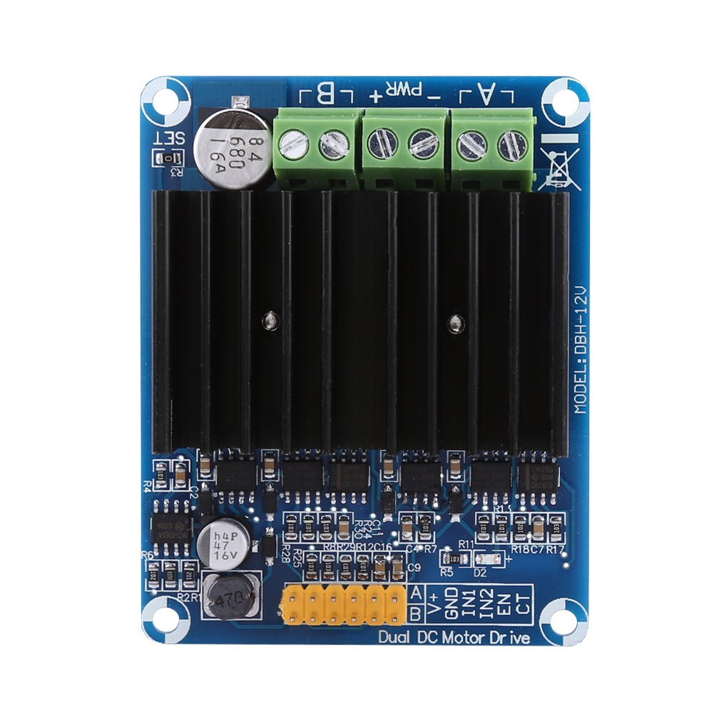
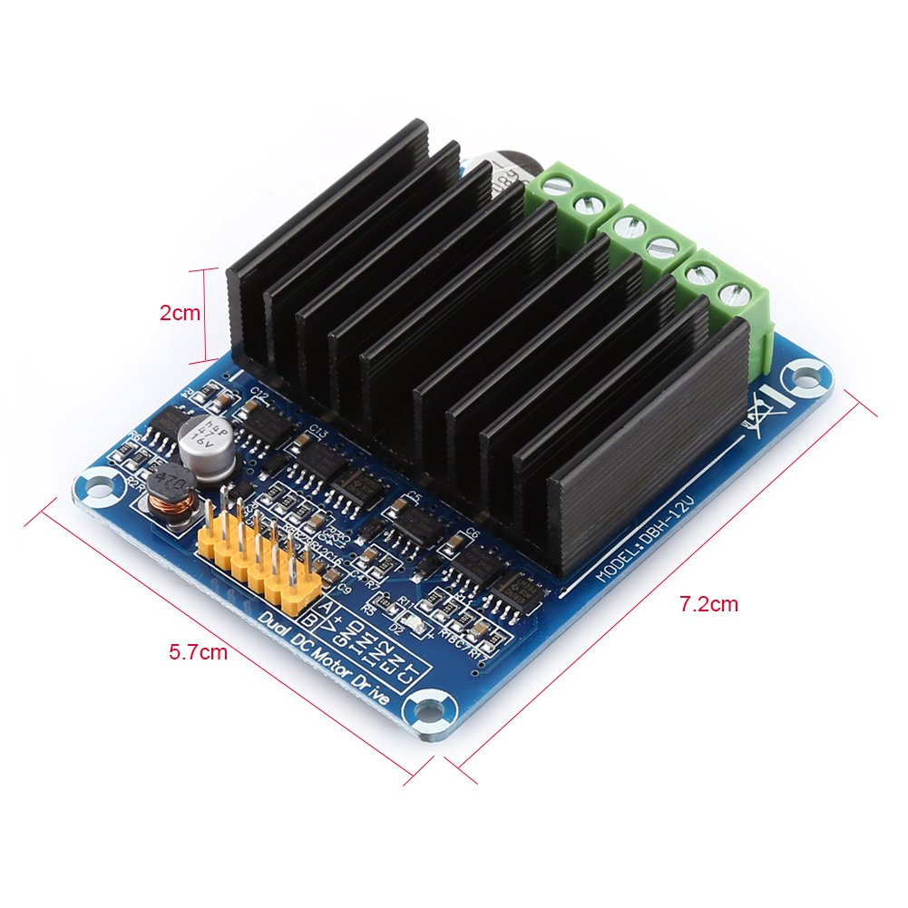

# Motion Control System

We will use Dual H-Bridge Driver Motor Controller

## Features: 
Compact size, light weight.
Apply to control ordinary DC motor, smart car motor, etc.
Reversible control and PWM speed control.
Design of high-speed switch.
Ultra low internal resistance, low heat.


## Technical Specifications:
Operating Voltage: DC5V-12V
Standby Current: <30mA ± 5mA
Working Current: 0A-30A (Max) / each channel.
PWM mode: Duty cycle: 0-98%.
Frequency: General Motors: 16 kHz; Coreless Motor: 80 kHz; TEC: 500Hz-80kHz.
Input Voltage Level: Low: 0-0.5 V; High: 2.5 V-13 V (typical unit level: 3.3 V, 5 V, 12 V)
Current Sampling: CT Pin Output 

Voltage (V) = current (A) * 0.155

Item size: 6.2 x 5.3 x 1.8cm


## Pinout


1-6  | 7-12
---- | ----
CT_A | CT_B
EN_A | EN_B
IN1_A | IN1_B
IN2_A | IN2_B
GND | GND
V+  A | V+ B




## Motor control protocol

### Low level communication

Commands sent to the controller:

to set the wheel diameter, used to compute the speed and to drive the robot using speed vector in the robot world:
```
[set_wheel_diam:120]

[set_pwm_range:|min:0|max:98]

[set_wheel_distance:250]
```


to set each motor speed:
```
[set_motors_speed|percent|left:30|right:-25]

[set_motors_speed|velocity|left:-120|right:-125]

[set_motors_speed|rpm|left:60|right:-60]
```

the sign indicate cw/ccw rotation

```
[set_motors_enable:true]

[set_motors_max_current:3500]

[set_motors_brake]
```


```
[set_robot_speed|radius:300|omega:-25.4]

[set_robot_speed|v_x:-300|v_y:254]
```

Values read from the controller:

```
[get_motors_status]

[side:left|enabled:true|rotation:cw|pwm:55|current:1540]

[side:right|enabled:true|rotation:ccw|pwm:15|current:420]
```

valid values:

  $$ I_{[mA]} =  \frac{1}{0.155} \times V_{[mV]} $$

*note*: speed_rpm is after gear reduction

to compute the actual speed in [m/s], given the wheel diameter in [m]: 
$$ speed = \frac{\pi}{60} \times rpm \times d $$

# Inverse Kinematic

Standing in pose $(x,y,\theta)$ at time t, determine control parameters $v_l$ and $v_r$ such that the pose at time $t + \delta t$ is $(\dot{x},\dot{y},\dot{\theta})$.

