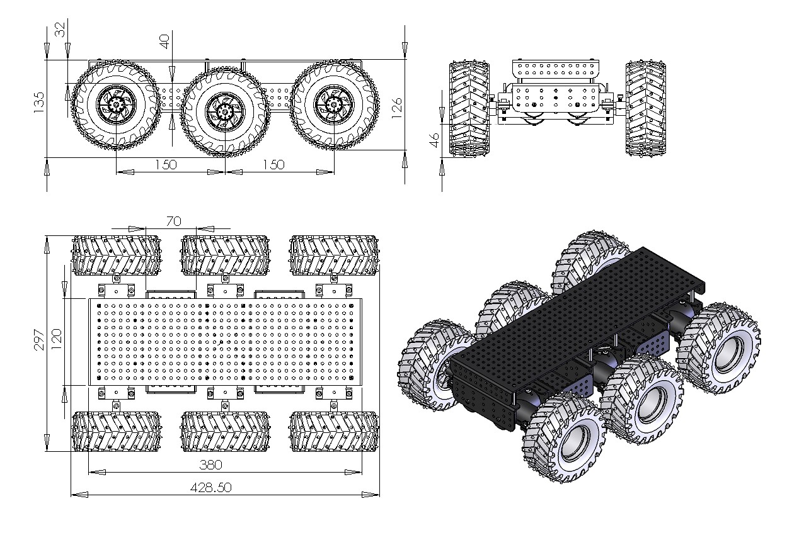
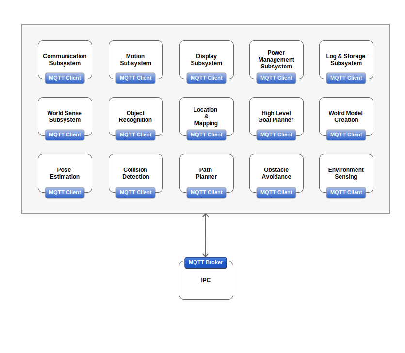

# Explora Rover Robot
6 wheels drive, all terrain, autonomous robot designed as a platform to experiment with autonomous driving vehicle.

Explora Robot is based on a well known commercial chassis widely available for hobbists 
[Dagu Thumper 6WD](https://www.sparkfun.com/products/11056).

Aim of this project is to design and build a robotic platform that will provide a set of interfaces, both software and hardware, that allow to build new layers with extended functionalities. Initial capabilities will include:

- indoor and outdoor navigation
- remote control and monitoring
- obstacle detection and avoidance
- simultaneus location and mapping (SLAM)
- viewpoints and landmark navigation
- terrain traversability estimation
- terrain negotiation
- path planning
- energy management and harvesting
- center of mass and pose estimation

## Tenets

- The system is open for modification without major disruption in all the parts.
- The robot can operate outdoor but its not designed for harsh environment. i.e. wet or dirty surfaces are allowed while waterproof is not in the scope.
- The energy consumption is frugal and a certain degree of autonomy is pursued. i.e. solar panel for energy harvesting or self recharging station could be implemented.
- The communication is bi-directional and mainly intended for monitoring and configuration than control (RC style).
- The robot can take advantage of many and concurrent localisation systems to establish its position in the environment. i.e. GPS, vision, LIDAR, utrasound, odometry, IMU, ...

## High level systems

### Power management system

This is responsible for providing power to the rover and all its subsystems, to monitor and recharge the batteries using both an external power source and solar panels. The system monitors the current drawn in real time by its major components: motors and all sub-systems; where possible each sub-system will provide its own power consumpion. Communications with the microcontroller (Arduino Micro) and other sub-systems is achieved via UART for the physical layer and with MQTT broker at ISO Application Layer (there will be a process on the main board (Raspberry Pi) that will have a process that act as a MQTT broker and that can communicate with a UART). 

Two mechanichal switches isolate the batteries from the rest of the system.

### Motion control system

### Communication system

### Logging system

The logging system is responsible for collecting data from each subsystem and storing it locally; the database of choice is InfluxDB (https://www.influxdata.com/time-series-platform/influxdb) that is a high-performance data store written specifically for time series data. The data we want lo log is in the format of time series and can be grouped in:
- **instrumentation data**. This is the data collected by the log system for each process that runs on every Raspberry PI. We use a logger that persists data on files, organised in folders with a specific naming convention (details in the paragraph). InfluxDB is installed on the main RPI and each other RPI has a process that periodically reads and import the log files into the DB, grouped by severity and by source and that takes care of their housekeeping.
- **system health data**. This collects all the data that allows to monitor and understand the system status. i.e. wifi RSSI, 2.4GHZ radio status, battery levels, system uptime, solar panes in use, number of remote sessions, number of battery recharges since day 1, etc.
- **sensors data**. This is the main source of data and is a collection of all the sensors, logged at the most appropriate rate. The only thing is not logged here, and probably is only stored in a folder, is the image video and audio (when capture is on) and image stills.

To complement the logging system, we will use Grafana  (https://grafana.com) to plot the data series collected.

